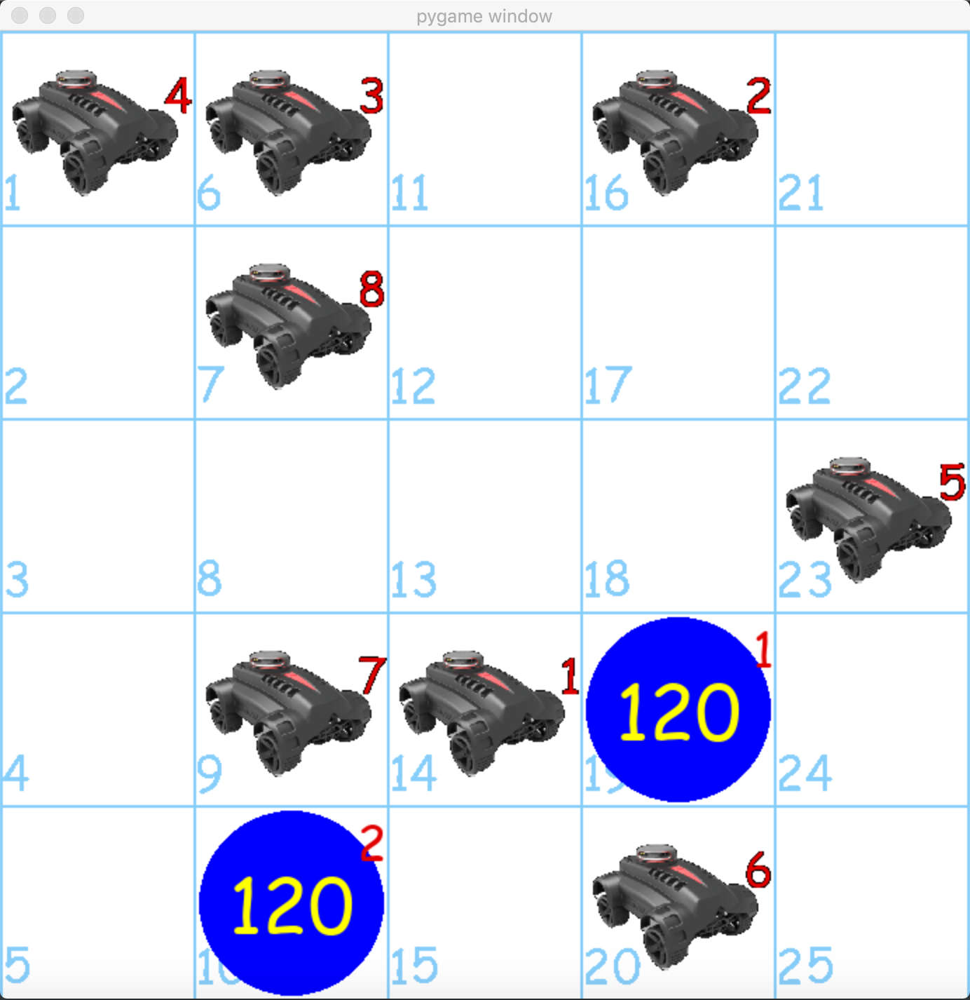

# Simulator for DCOP-MST type of problems where locations (cells) are also nodes

Distributed Constrained Optimization Problems 
in context of Mobile Sensor Teams (DCOP_MST).
This simulator helps to improve the understanding
of underlying dynamics of those kind of problems.

**Here: cells and targets - function nodes, robots - variable nodes.**

The initial settings are in `CONCTANTS.py` file.

## Screen Samples

Small Grid                  | Large Grid
--------------------------- | ---------------------------
 | 

